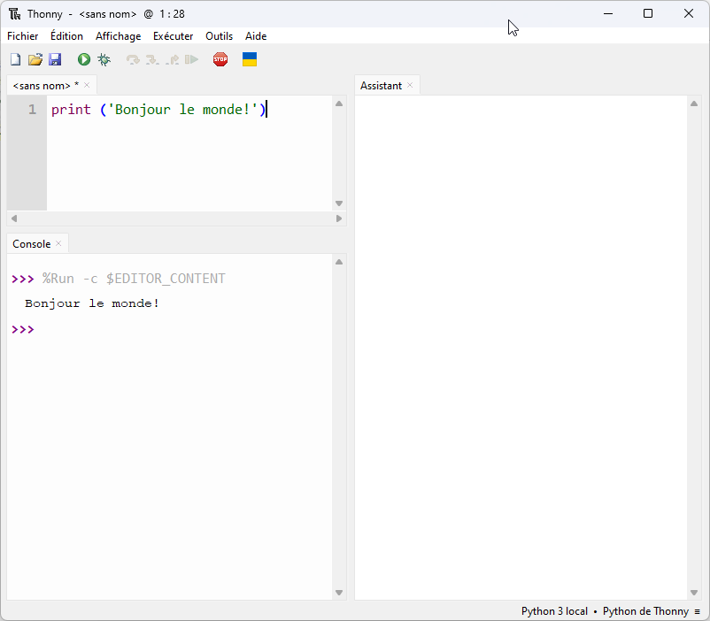
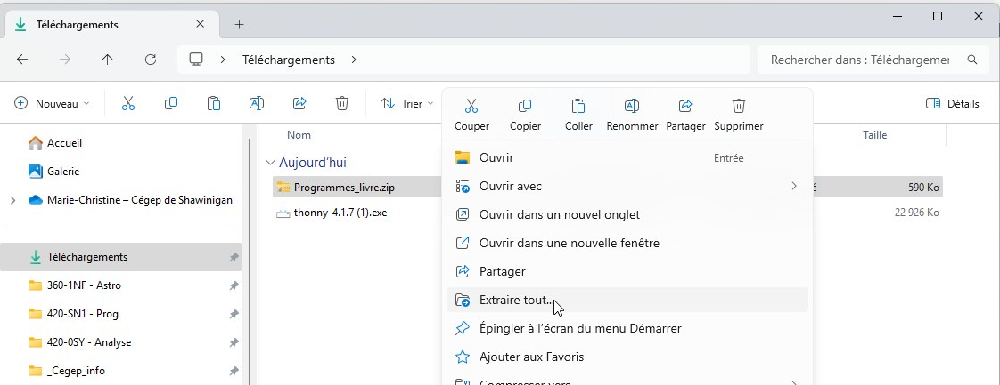

# Introduction

Ce cours a pour but de vous initier à la programmation. Le langage utilisé sera Python. Vous apprendrez à utiliser les bases du langage de programmation Python pour manipuler des données, créer des graphiques et effectuer des calculs. Python est un langage de programmation très populaire. Il est utilisé dans de nombreux domaines, notamment dans la science des données, l'analyse de données, l'ingénierie, la recherche, l'automatisation des tâches, etc. Il est également très populaire dans l'enseignement de la programmation.
Les notes de cours et les exercices seront détaillées dans le manuel de cours. 

# Plan de la semaine 1, cours 1

## Plan de cours

Disponible sur Omnivox.

## Configuration de l'environnement de travail

La première étape sera de configurer l'environnement de travail. Pour cela, nous allons installer le logiciel Thonny qui nous permettra d'écrire et d'exécuter nos programmes en Python.

### Installation de Thonny
Thonny est un éditeur de code épuré pour faire des algorithmes en Python. Pour l'installer, il faudra le télécharger.

Veuillez suivre les étapes suivantes :
1. Ouvrez un navigateur web.
2. Allez sur le site web de Thonny : https://thonny.org/
3. Téléchargez la version de Thonny qui correspond à votre système d'exploitation soit Windows, Mac ou Linux.
   - Prenez le premier lien. Au moment d'écrire ces lignes, j'utilisais la version 4.1.2 de Thonny.
  
   - 

4. Atteignez le dossier des téléchargements de votre ordinateur.
5. Double-cliquez sur le fichier téléchargé pour lancer l'installation.
6. Suivez les instructions d'installation. Généralement, ce sera de cliquer sur le bouton `Suivant` jusqu'à ce que l'installation soit terminée.

Vous devriez maintenant avoir Thonny d'installé sur votre ordinateur. Pour valider, allez dans le menu démarrer de Windows et cherchez Thonny.


### Testez Thonny
Pour tester Thonny, nous allons écrire un programme qui affiche `Bonjour le monde!` à l'écran.

Exécutez les étapes suivantes :
1. Ouvrez Thonny.
2. Lors de la première exécution, il demandera de choisir la langue. Choisissez `Français`.
3. Tapez le code suivant dans la fenêtre de Thonny :
   ```python
   print("Bonjour le monde!")
   ```
4. Cliquez sur le bouton `Exécuter` ou appuyez sur la touche `F5` du clavier.
   - Le bouton est le petit triangle vers qui ressemble à un bouton `Play` sur un lecteur de musique. 
5. Dans la console, vous devriez voir le message `Bonjour le monde!` s'afficher.
   



> **Note** : Thonny est loin d'être le seul environnement de travail. Il en existe beaucoup d'autres. Cependant, Thonny est un environnement de travail qui est très simple à utiliser et qui est très bien adapté pour les débutants. Il est donc parfait pour ce cours. De plus, il est à code source ouvert et gratuit. 


## Création d'un dossier pour y mettre le matériel de la session

Dans l'explorateur de fichiers, créer un sous-dossier à un endroit où votre matériel sera facile d'accès, avec un chemin significatif. Par exemple, dans un dossier "H25", ensuite dans un dossier "Prog". On y mettra les fichiers de code qui seront écrits dans la session.


# Travail à faire:

Cette section sera souvent mise à jour après le dernier cours de la semaine.

- Lire les pages 6 à 12 du manuel
- Explorer les diverses sections du logiciel Thonny
- Télécharger les programmes du livre sur Omnivox et décompresser (unzip) le dossier




# Exercices:
- page 27 # 1 à 11 (il y a une petite erreur dans le corrigé du numéro 3)


